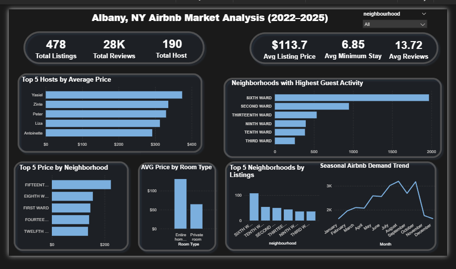
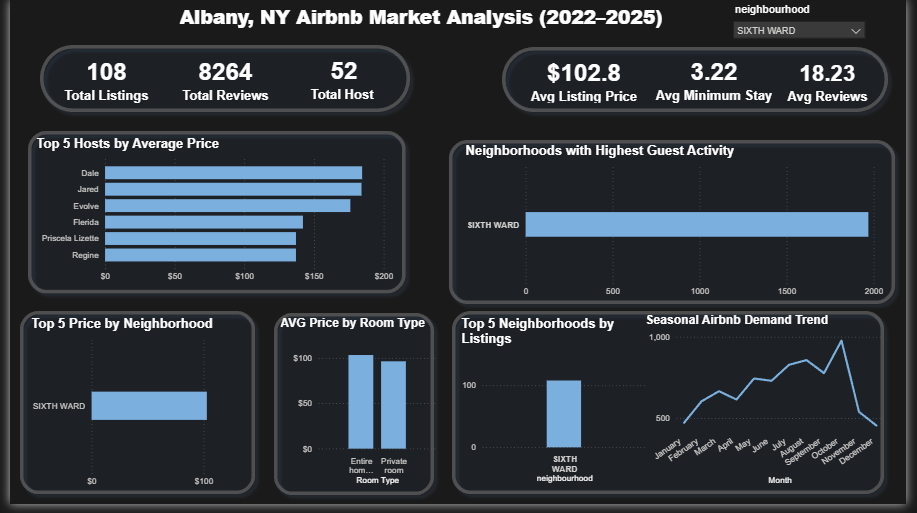

# Albany, NY Airbnb Market Analysis (2022–2025)

## Project Overview

This project analyzes the Airbnb market in **Albany, New York** using Power BI to explore pricing trends, neighborhood demand, host performance, and seasonal booking patterns.

The goal of this analysis is to understand how the local Airbnb market behaves and provide insights that could help a **current or potential Airbnb host make better pricing and location decisions**.

Using interactive visuals, the dashboard highlights which neighborhoods generate the most guest activity, how pricing varies across the city, and when demand tends to increase throughout the year.

---

## 📊 Dashboard Overview

The dashboard provides a high-level overview of Albany’s Airbnb market including:

- Total listings available
- Total guest reviews across the platform
- Number of active hosts
- Average listing price
- Average minimum stay requirements
- Average reviews per listing

Key metrics from the dataset include:

- **478 total listings**
- **28K+ guest reviews**
- **190 hosts operating listings**
- **Average nightly price of $113**
- **Average minimum stay of ~6.8 nights**

These metrics provide a snapshot of the overall scale and activity of the Airbnb marketplace in Albany.

---

## Key Business Questions

This analysis focuses on answering several important questions about Albany’s Airbnb market:

- Which **neighborhoods attract the most guests**?
- Which **hosts charge the highest average prices**?
- Where is **competition highest in terms of listings**?
- How does **property type influence pricing**?
- Are there **seasonal patterns in Airbnb demand**?

Understanding these questions helps hosts make decisions about **where to operate, how to price their listings, and when demand is highest**.

---

## Highest Guest Activity: Sixth Ward

One of the most notable insights from the analysis is that the **Sixth Ward stands out as the neighborhood with the highest guest activity**.

When filtering the dashboard to focus on the Sixth Ward, the data reveals:

- **108 listings** located in this neighborhood
- **8,264 total reviews**, significantly higher than other areas
- **52 hosts operating listings**
- An **average nightly price of approximately $102**

This suggests that the Sixth Ward has particularly strong traveler demand, which may be influenced by factors such as:

- Location convenience
- Local attractions
- Competitive pricing
- Availability of listings

For hosts or investors considering entering the Albany Airbnb market, the Sixth Ward appears to be one of the **most active and competitive areas**.

---

## Pricing Insights

The dashboard also highlights differences in pricing across hosts and property types.

### Top Hosts by Average Price

Certain hosts consistently charge higher prices, suggesting:

- Premium property offerings
- Unique listing experiences
- Strategic pricing strategies

Understanding these hosts can help identify **pricing benchmarks within the market**.

---

### Price by Room Type

Listings categorized as **entire home or apartment** command significantly higher average prices compared to **private rooms**.

This reflects the typical Airbnb market pattern where travelers pay a premium for:

- Privacy
- Full property access
- Larger accommodations

---

## Supply vs Demand

The analysis also compares **where listings exist versus where demand is strongest**.

For example:

- **Sixth Ward** leads in guest activity and listing volume.
- Some neighborhoods show **higher prices but fewer reviews**, suggesting different market dynamics.

This difference highlights the importance of balancing:

- **Price strategy**
- **Guest demand**
- **Listing competition**

---

## Seasonal Airbnb Demand

The dashboard also reveals **clear seasonal trends in Airbnb activity**.

Demand gradually rises throughout the year, reaching its peak during **late summer and fall months**. Activity then drops significantly in **December and January**, which may be explained by:

- Travelers spending holidays with family
- Reduced winter tourism
- Seasonal travel patterns

Understanding these patterns can help hosts plan:

- Pricing adjustments
- Availability strategies
- Promotional periods

---

## Tools Used

This project demonstrates the use of several data analytics tools and techniques:

- **Power BI** for dashboard development and visualization
- **Power Query** for data cleaning and transformation
- **Data modeling** to structure relationships between listings and reviews
- **Interactive filtering** to allow exploration by neighborhood
- **Data storytelling** to present insights in a clear and structured way

---

## Project Outcome

This dashboard provides a clear picture of the Albany Airbnb market and demonstrates how data can be used to support **business decisions in the short-term rental industry**.

By combining pricing analysis, demand indicators, and seasonal trends, the dashboard helps identify:

- High-demand neighborhoods
- Competitive pricing strategies
- Areas with strong guest engagement
- Seasonal demand patterns

These insights can help hosts better position their listings and maximize their performance in the marketplace.

---
